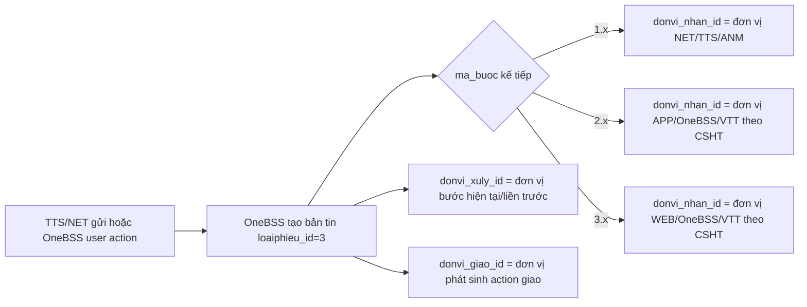

# Tài liệu cho NET - Protocol `loaiphieu_id=3`

## Mục tiêu

Tài liệu này mô tả cách phía NET/TTS nên hiểu bản tin OneBSS gửi về với `loaiphieu_id=3` trong quy trình `QTATBM_ACCESS`.

Nguyên tắc quan trọng nhất:

- `ma_buoc` trong bản tin là **bước kế tiếp sẽ diễn ra**.
- `donvi_nhan_id` là **đơn vị nhận xử lý bước kế tiếp**.
- `donvi_xuly_id` là **đơn vị xử lý ở bước hiện tại/liền trước**, dùng để hỗ trợ render timeline.
- `donvi_giao_id` là **đơn vị phát sinh action chuyển phiếu**.

## Nhóm field đơn vị/nhân viên

| Nhóm | Field | Ý nghĩa |
|---|---|---|
| Giao | `donvi_giao_id`, `ten_donvi_giao` | Đơn vị thực hiện action chuyển/giao phiếu |
| Nhận | `donvi_nhan_id`, `ma_donvi_nhan_id`, `ten_donvi_nhan` | Đơn vị xử lý bước kế tiếp tương ứng với `ma_buoc` |
| Xử lý | `donvi_xuly_id`, `ma_donvi_xuly_hrm`, `ma_nhanvien_xuly` | Ngữ cảnh xử lý bước hiện tại/liền trước để render timeline |

## Phân loại bước

| Nhóm bước | Phía xử lý | Cách hiểu `donvi_nhan_id` |
|---|---|---|
| `1.x` | NET/TTS/ANM | Đơn vị phía NET/TTS/ANM nhận bước kế tiếp |
| `2.x` | APP/OneBSS/VTT | Đơn vị APP/OneBSS/VTT nhận bước kế tiếp theo cấu hình CSHT |
| `3.x` | WEB/OneBSS/VTT | Đơn vị WEB/OneBSS/VTT nhận bước kế tiếp theo cấu hình CSHT |

## Cách đọc một lần chuyển bước

Ví dụ OneBSS gửi bản tin `loaiphieu_id=3` với `ma_buoc = 3.2`:

| Field | Cách hiểu |
|---|---|
| `ma_buoc = 3.2` | Bước kế tiếp là `3.2` |
| `donvi_nhan_id` | Đơn vị sẽ xử lý bước `3.2` |
| `donvi_xuly_id` | Đơn vị của bước liền trước trên timeline |
| `donvi_giao_id` | Đơn vị phát sinh action chuyển sang `3.2` |
| `ma_nhanvien_xuly` | User/action actor tạo bản tin, giữ theo thuật toán hiện tại |

## Các luồng QC đã passed

### WEB

| `id_tts` | Chuỗi bước | Ghi chú |
|---|---|---|
| `10248389` | `1.1 => 1.2 => 3.1 => 1.2 => 1.3 => 3.2 => 1.6 => 1.7` | OK |
| `10247861` | `1.1 => 1.2 => 3.1 => 1.2 => 1.7` | OK |
| `10245416` | `1.1 => 1.5 => 3.2 => 1.6 => 1.7` | OK |

### APP

| `id_tts` | Chuỗi bước | Ghi chú |
|---|---|---|
| `10248376` | `1.1 => 1.5 => 2.1 => 1.6 => 1.7` | OK |
| `10245404` | `1.1 => 1.3 => 2.1 => 2.2 => 1.4 => 2.1 => 1.6 => 1.7` | OK |
| `10245322` | `1.1 => 1.3 => 3.2 => 3.3 => 1.5 => 3.2 => 1.6 => 1.7` | OK |

### APP + WEB

| `id_tts` | Chuỗi bước | Ghi chú |
|---|---|---|
| `10245402` | `1.1 => 1.3 => 2.1 => 2.2 => 1.4 => 2.1 => 1.6 => 3.2 => 3.3 => 1.5 => 2.1 => 1.6 => 1.7` | OK |
| `10245385` | `1.1 => 1.3 => 3.2 => 3.3 => 1.5 => 3.2 => 1.6 => 2.1 => 1.6 => 1.7` | OK |
| `10245438` | `1.1 => 1.2 => 3.1 => 1.2 => 1.3 => 2.1 => 1.6 => 1.7` | OK |

## Mermaid tổng quát

## Lưu ý tích hợp

Phía NET/TTS nên dùng `donvi_nhan_id` để xác định đơn vị nhận bước kế tiếp theo `ma_buoc`. Nếu cần render timeline, dùng `donvi_xuly_id` làm ngữ cảnh bước hiện tại/liền trước thay vì suy luận ngược từ `donvi_giao_id`.
